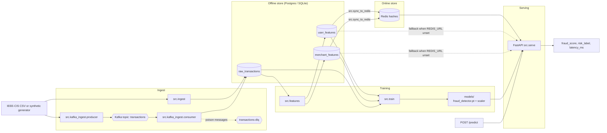

# Argos

> **Real-time fraud scoring service: FastAPI + PyTorch, Postgres/Redis features, Kafka ingest.**

Real time fraud detection API that takes payment events from a CSV or a Kafka topic,
turns them into per-user and per-merchant features in an offline store,
trains a PyTorch classifier, and serves fraud scores from a FastAPI endpoint
backed by an online feature store. Same code paths run locally, in Docker, or
on Kubernetes.

- **Storage** — SQLite by default; one env var swaps to Postgres.
- **Online features** — in-memory by default; one env var swaps to Redis.
- **Ingest** — batch CSV or Kafka (producer → topic → consumer → DB).
- **Serving** — FastAPI with `/predict`, `/health`, `/stats`, optional per-request timing breakdown.
- **Demo UI** — zero-dependency static page served from the API at `/ui` for poking at the model in a browser.
- **Operability** — Dockerfile (non-root, healthcheck), `docker-compose.yml`, Kubernetes manifests with HPA.

---

## Contents

- [Quick start](#quick-start)
- [Architecture](#architecture)
- [Configuration](#configuration)
- [Deployment](#deployment)
- [API](#api)
- [Repository layout](#repository-layout)
- [Development](#development)
- [Security &amp; limitations](#security--limitations)
- [Roadmap](#roadmap)
- [License](#license)

---

## Quick start

**Prerequisites:** Python **3.10+** (the Docker image uses 3.13), Git, and
Docker for Redis / Kafka / the API image.

```bash
git clone https://github.com/abdelmagid07/argos
cd argos
python -m venv .venv
# Windows:  .venv\Scripts\activate
# macOS/Linux:  source .venv/bin/activate
pip install -r requirements.txt
cp .env.example .env
```

Run the whole pipeline (ingest → features → train → serve → smoke-test)
against synthetic data on SQLite, no extra services needed:

```bash
python run_all.py --synthetic --reset
```

To run against the optional online feature store, start Redis and re-run:

```bash
docker compose up -d redis
echo "REDIS_URL=redis://localhost:6380" >> .env
python run_all.py
```

Once the API is up (port 8000):

```bash
curl -s http://localhost:8000/health | python -m json.tool

curl -s -X POST http://localhost:8000/predict \
  -H 'Content-Type: application/json' \
  -d '{"user_id": 1234, "merchant_id": 42, "amount": 250.0}'
```

Useful `run_all.py` flags:

| Flag | Effect |
|------|--------|
| `--synthetic` | Force synthetic data even if the Kaggle CSV is present. |
| `--reset` | Truncate tables before ingest (use after schema changes). |
| `--rows N` | Cap row count (real or synthetic). |
| `--epochs N` | Override training epochs. |
| `--skip train` | Reuse last-trained weights. |
| `--only smoke_test` | Hit a server you already have running. |
| `--no-server` | ETL only, no serve stage. |
| `--keep-server` | Leave the API running after smoke-test. |
| `--workers N` | Run uvicorn with N worker processes. |
| `--via-docker` | Serve from the API container instead of host uvicorn. |

> Optional realism: drop Kaggle [`train_transaction.csv`](https://www.kaggle.com/c/ieee-fraud-detection)
> into `data/` and re-run; the ingest step prefers real data when available.

---

## Architecture



| Layer | Default | Override |
|-------|---------|----------|
| Offline store | SQLite (`argos.db`) | `DATABASE_URL` → Postgres / Supabase |
| Online features | In-memory dict | `REDIS_URL` → Redis hashes |
| Ingest | Direct CSV → DB | Kafka producer → topic → consumer → DB |
| Serving | `uvicorn` on host | `--workers N`, Docker, or Kubernetes |

Backend selection lives entirely in [`src/db.py`](src/db.py) and
[`src/feature_store.py`](src/feature_store.py); the rest of the code stays
unchanged when you swap stores.

---

## Configuration

Copy [`.env.example`](.env.example) to `.env` (gitignored). Every variable is
optional — the defaults run end-to-end on SQLite + the in-memory feature store.

| Variable | Purpose |
|----------|---------|
| `DATABASE_URL` | PostgreSQL URL (e.g. Supabase pooler on port 6543). Empty → SQLite. |
| `REDIS_URL` | e.g. `redis://localhost:6380` (Compose maps 6379 → 6380 on the host). |
| `KAFKA_BOOTSTRAP_SERVERS` | Comma-separated brokers; default `localhost:9092`. |
| `KAFKA_TOPIC` / `KAFKA_DLQ_TOPIC` / `KAFKA_GROUP_ID` | Topic + consumer-group names. |
| `ARGOS_CORS_ALLOW_ORIGINS` | Comma-separated origins allowed by the API. Default `*` (demo UI). |

For Postgres, run [`schema.sql`](schema.sql) in the SQL editor or rely on
`init_schema` (it issues idempotent `CREATE TABLE IF NOT EXISTS` on first run).

---

## Deployment

### Local (host)

```bash
python -m src.ingest      # batch CSV → DB
python -m src.features    # offline features
python -m src.train       # PyTorch model + scaler
uvicorn src.serve:app --port 8000 --workers 4
```

`--workers N` scales the synchronous predict path across cores on multi-core
hosts. `python run_all.py --workers 4 --keep-server` does the same end-to-end
via the orchestrator.

### Docker (API image)

Requires the trained artifacts under `models/` (the Dockerfile copies them in).
Build, run, and follow logs:

```bash
docker compose up -d --build api
docker compose logs -f api
```

The compose file overrides `REDIS_URL` to `redis://redis:6379` inside the
network so the API container reaches Redis by service name regardless of
your host port mapping.

### Kafka

```bash
docker compose up -d zookeeper kafka

# Terminal 1
python -m src.kafka_ingest.consumer

# Terminal 2
python -m src.kafka_ingest.producer --synthetic --rows 5000
```

Then continue with `features` → `train` → `sync_to_redis` (optional) →
`serve`. Direct CSV ingest does not require Kafka.

### Kubernetes (`kind`)

Manifests live in [`k8s/`](k8s/). Typical flow:

```bash
docker build -t argos-api:dev .
kind load docker-image argos-api:dev --name <cluster-name>
kubectl apply -f k8s/namespace.yaml \
              -f k8s/configmap.yaml \
              -f k8s/deployment.yaml \
              -f k8s/service.yaml \
              -f k8s/hpa.yaml
kubectl port-forward -n argos svc/argos-api 18000:80
curl -s http://localhost:18000/health
```

[`k8s/secret-argos-api.example.yaml`](k8s/secret-argos-api.example.yaml) is a
template — do not apply it with real credentials committed. Use
`kubectl create secret generic argos-api-secrets ...` instead.
**metrics-server** is required for the HPA.

---

## API

| Method | Path | Description |
|--------|------|-------------|
| `GET` | `/health` | Liveness probe; reports feature-store backend and counts. |
| `POST` | `/predict` | `{user_id, merchant_id, amount}` → fraud score + risk label. |
| `POST` | `/predict?timings=1` | Adds `breakdown_ms` (features, prep, scaler, model). |
| `GET` | `/features/{user_id}` | Cached per-user features (404 if unknown). |
| `GET` | `/merchants/{merchant_id}` | Cached per-merchant features. |
| `GET` | `/sample_keys?n=50` | Random `(user_id, merchant_id)` pairs from the offline DB. |
| `GET` | `/stats` | Rolling counters, latency p50/p95/p99, in-flight gauge. |
| `GET` | `/docs` | Auto-generated Swagger UI. |
| `GET` | `/ui` | Static demo dashboard (see below). |

```bash
curl -s -X POST http://localhost:8000/predict \
  -H 'Content-Type: application/json' \
  -d '{"user_id": 1234, "merchant_id": 42, "amount": 250.0}'
```

```json
{
  "fraud_score": 0.0231,
  "risk_label": "low",
  "model_version": "v1",
  "latency_ms": 3.4,
  "used_user_features": true,
  "used_merchant_features": true
}
```

### Demo UI

With the API running, open <http://localhost:8000/ui> in a browser. The page is
a single, dependency-free HTML file ([`web/index.html`](web/index.html)) that:

- pre-fills `user_id` / `merchant_id` dropdowns from `GET /sample_keys` so you
  exercise the warm path, not just cold-start;
- shows the model's `fraud_score`, `risk_label`, and a per-stage server
  latency breakdown from `POST /predict?timings=1`;
- displays the cached features for the selected user via `GET /features/{user_id}`;
- polls `GET /stats` every few seconds and renders live p50 / p95 / p99 latency
  plus in-flight and missing-feature counters.

CORS defaults to `*` so the page also works when served from a separate origin
(e.g. Vercel/Netlify) during development; lock it down with
`ARGOS_CORS_ALLOW_ORIGINS=https://your.app` in production.

---

## Repository layout

```text
├── Dockerfile / docker-compose.yml   # API image + local infra (Redis, Kafka)
├── k8s/                              # Namespace, Deployment, Service, HPA, Secret template
├── run_all.py                        # Orchestrated pipeline + smoke-test
├── requirements.txt                  # Pinned runtime deps
├── schema.sql                        # Postgres schema for Supabase SQL editor
├── src/
│   ├── ingest.py / features.py / train.py / serve.py
│   ├── db.py                         # Dual SQLite / Postgres backend
│   ├── feature_store.py              # InMemory and Redis backends
│   ├── redis_store.py / sync_to_redis.py
│   ├── model.py                      # PyTorch MLP
│   ├── smoke_test.py                 # End-to-end latency + score sanity check
│   ├── config.py
│   └── kafka_ingest/                 # Producer, consumer, idempotent topic bootstrap
├── web/                              # Static demo UI served at /ui
├── data/                             # CSV inputs (gitignored)
└── models/                           # Trained weights + scaler (gitignored)
```

---

## Development

- **Smoke test:** `python -m src.smoke_test --host http://localhost:8000 --requests 500`
- **End-to-end:** `python run_all.py` (or `--no-server` for ETL only)
- **Container hygiene:** Dockerfile installs the CPU-only PyTorch wheel, runs
  as a non-root user, and ships a small `urllib`-based healthcheck.

---

## License

Released under the [MIT License](LICENSE).
