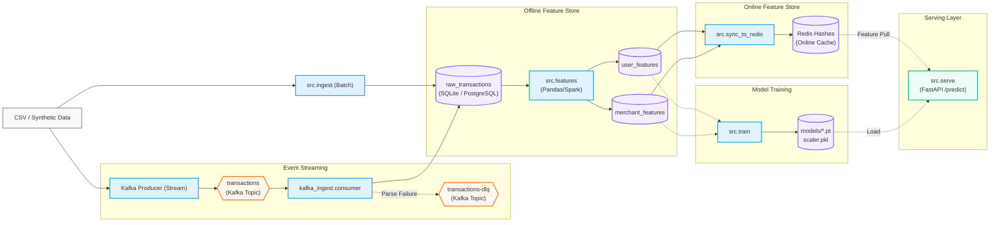

# Argos

End-to-end **fraud scoring** demo: batch or Kafka ingest → offline feature
tables → **PyTorch** model training → **FastAPI** `/predict` with a pluggable
**online feature store** (in-memory or **Redis**). Offline data defaults to
**SQLite**; swap in **Supabase Postgres** with one env var. Optional **Docker**
and **Kubernetes (kind)** show how the same API image scales.


---

### Contents

- [Quick start](#quick-start)
- [Architecture](#architecture)
- [Configuration](#configuration)
- [Deployment options](#deployment-options)
- [API](#api)
- [Repository layout](#repository-layout)
- [Development & testing](#development--testing)
- [Benchmarks](#benchmarks)
- [Security](#security)
- [Roadmap](#roadmap)
- [License](#license)

---

## Quick start

**Prerequisites:** Python **3.10+** (3.13 matches [`Dockerfile`](Dockerfile)),
**Git**, and **Docker** (recommended for Redis / Kafka / the API image).

```bash
git clone https://github.com/abdelmagid07/argos
cd Argos
python -m venv .venv
```

Activate the venv (Windows: `.venv\Scripts\activate`, macOS/Linux:
`source .venv/bin/activate`), then:

```bash
pip install -r requirements.txt
cp .env.example .env
```

**Redis (recommended)** — matches [`docker-compose.yml`](docker-compose.yml)
host port **6380**:

```bash
docker compose up -d redis
```

In `.env`:

```env
REDIS_URL=redis://localhost:6380
```

Leave `DATABASE_URL` empty to use **SQLite** (`argos.db`). If you do not have
the IEEE-CIS CSV yet, use synthetic data:

```bash
python run_all.py --synthetic --reset
```

Default `python run_all.py` runs **ingest → features → sync_to_redis → train →
uvicorn → smoke_test**. `sync_to_redis` is skipped when `REDIS_URL` is unset.

Useful flags:

```text
--skip train          Reuse existing weights in models/
--no-server           Data pipeline only
--keep-server         Leave API on :8000 after smoke_test
--via-docker          Run the API via `docker compose` (requires trained models/)
```

**Try the API** (port 8000):

```bash
curl -s http://localhost:8000/health | python -m json.tool
python -m src.smoke_test --host http://localhost:8000 --requests 200
```

**Explore Compose:** `docker compose ps` (Redis **6380→6379**, Kafka **9092**).

**Optional:** place Kaggle
[`train_transaction.csv`](https://www.kaggle.com/c/ieee-fraud-detection)
under `data/` for realistic training data.

---

## Architecture



Batch ingest (`python -m src.ingest`) and streaming ingest (producer → Kafka →
consumer) both populate `raw_transactions`; downstream steps are the same.

| Layer           | Default              | Override                                      |
|-----------------|----------------------|-----------------------------------------------|
| Offline store   | SQLite (`argos.db`)  | `DATABASE_URL` → Postgres / Supabase        |
| Online features | In-memory dict       | `REDIS_URL` → Redis (`src/feature_store.py`) |

Backend selection is centralized in [`src/db.py`](src/db.py) and
[`src/feature_store.py`](src/feature_store.py); serving code stays unchanged
when you swap stores.

---

## Configuration

Copy [`.env.example`](.env.example) to `.env`. Never commit `.env`.

| Variable | Purpose |
|----------|---------|
| `DATABASE_URL` | PostgreSQL (e.g. Supabase **pooler** URL, port **6543**). Empty → SQLite. |
| `REDIS_URL` | e.g. `redis://localhost:6380` (host port from Compose). |
| `KAFKA_*` | Bootstrap servers, topic, DLQ, consumer group (`kafka_ingest`). |

For Supabase, run [`schema.sql`](schema.sql) in the SQL editor **or** rely on
`init_schema` when you first run ingest against Postgres — both create the same
tables (see [`src/db.py`](src/db.py)).

---

## Deployment options

### SQLite only (no Docker)

Omit `REDIS_URL` to use the in-memory feature store, or set Redis as above.
Then `python run_all.py` or run stages manually:

```bash
python -m src.ingest
python -m src.features
python -m src.train
uvicorn src.serve:app --port 8000
```

### Postgres (Supabase)

1. Create a project; copy the **transaction pooler** connection string.
2. Set `DATABASE_URL` in `.env`.
3. Apply [`schema.sql`](schema.sql) in the Supabase SQL editor (recommended for
   visibility) or create tables on first `ingest`.
4. Run the same pipeline as locally.

### Redis

Documented in **Quick start**. After `features`, run `python -m src.sync_to_redis`
(or use `run_all.py`, which runs it when `REDIS_URL` is set). TTL defaults to
1 hour (`--ttl` to override).

### Kafka

```bash
docker compose up -d zookeeper kafka
```

Wait until `argos-kafka` is healthy. In one terminal:
`python -m src.kafka_ingest.consumer`. In another:
`python -m src.kafka_ingest.producer` (add `--synthetic --rows 5000` for a small
demo). Then continue with `features` → `train` → `sync_to_redis` → `serve`.
Direct CSV ingest does **not** require Kafka.

### Docker (API image)

Requires trained artifacts under `models/` (`fraud_detector_v1.pt`,
`scaler.pkl`, `feature_columns.json`).

```bash
docker compose up -d --build api
```

On Compose v2.29+, you can use `docker compose up -d --wait api` blocks until
the service healthcheck passes. The compose file overrides `REDIS_URL` to
`redis://redis:6379` inside the network. Alternatively:
`python run_all.py --via-docker`.

### Kubernetes (kind)

Manifests live in [`k8s/`](k8s/). Typical flow:

```bash
docker build -t argos-api:dev .
kind load docker-image argos-api:dev --name <cluster-name>
kubectl apply -f k8s/namespace.yaml -f k8s/configmap.yaml \
  -f k8s/deployment.yaml -f k8s/service.yaml -f k8s/hpa.yaml
```

Do **not** apply [`k8s/secret-argos-api.example.yaml`](k8s/secret-argos-api.example.yaml)
with real credentials committed to git — copy locally or use
`kubectl create secret generic argos-api-secrets ...`. **metrics-server** (plus
the usual kind kubelet TLS patch) is required for the HPA. Redis often stays on
the host; tune [`k8s/configmap.yaml`](k8s/configmap.yaml) if your host port
differs from **6380**.

```bash
kubectl port-forward -n argos svc/argos-api 18000:80
curl -s http://localhost:18000/health
```

---

## API

| Method | Path | Description |
|--------|------|-------------|
| `GET` | `/health` | Liveness; feature-store backend and counts. |
| `POST` | `/predict` | JSON body: `user_id`, `merchant_id`, `amount` → fraud score. |
| `GET` | `/stats` | In-process counters and rolling latency percentiles. |

Example:

```bash
curl -s -X POST http://localhost:8000/predict \
  -H 'Content-Type: application/json' \
  -d '{"user_id": 1234, "merchant_id": 42, "amount": 250.0}'
```

---

## Repository layout

```text
├── Dockerfile / docker-compose.yml   # API image + local infra
├── benchmarks/                       # Locust + throughput docs
├── run_all.py                        # Orchestrated pipeline + smoke test
├── requirements.txt
├── schema.sql
├── k8s/
├── src/
│   ├── ingest.py / features.py / train.py / serve.py
│   ├── db.py / feature_store.py / redis_store.py / sync_to_redis.py
│   ├── model.py
│   ├── smoke_test.py
│   └── kafka_ingest/
├── data/                             # CSV input (gitignored)
├── models/                           # Weights + scaler 

```

---

## Development & testing

- **Lint/format:** follow PEP 8; no mandatory hook is enforced in-repo.
- **Smoke test:** `python -m src.smoke_test` (samples IDs from the DB when
  possible).
- **End-to-end:** `python run_all.py` (or `--no-server` for ETL-only).

The Docker image installs a **CPU-only** PyTorch wheel and runs as a **non-root**
user; see [`Dockerfile`](Dockerfile).

---

## Security

- **Secrets:** use `.env` locally and Kubernetes **Secrets** in-cluster (see
  [`k8s/secret-argos-api.example.yaml`](k8s/secret-argos-api.example.yaml)).
  Never commit `.env`, database URLs, or API keys.
- **Redis / Kafka** here use **no auth** — appropriate for local learning only;
  use TLS and passwords in real deployments.

---

## Roadmap

| Stage | Status |
|-------|--------|
| MVP (SQLite, in-memory serve) | Done |
| Postgres / Supabase | Done |
| Redis online store | Done |
| Kafka ingest | Done |
| Spark batch features | *Deferred* (pandas sufficient at current scale) |
| Docker | Done |
| Kubernetes + HPA | Done |

---

## License

Released under the [MIT License](LICENSE).
